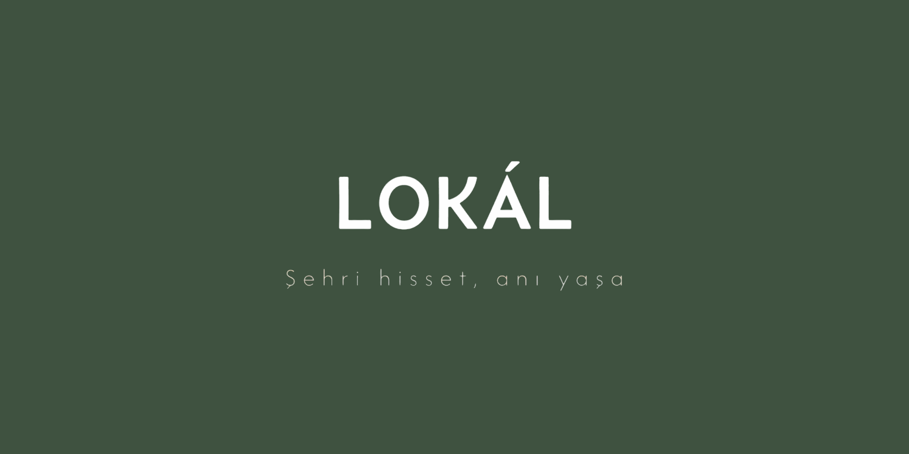

# **Team Lokál**
Takım 24
# Ürün İle İlgili Bilgiler

## Takım Elemanları

<table>
  <tr>
    <td align="center">
      <a href="https://github.com/elifozlembagci">
        
         
        <b>Elif Özlem Bağcı</b>
      </a>
       
      Scrum Master
    </td>
    <td align="center">
      <a href="https://github.com/[aybuke-github]">
        
         
        <b>Aybüke Karaçavuş</b>
      </a>
       
      Product Owner
    </td>
    <td align="center">
      <a href="https://github.com/alperenynk">
        
         
        <b>Alperen Yanık</b>
      </a>
       
      Developer
    </td>
    <td align="center">
      <a href="https://github.com/[emre-github]">
        
         
        <b>Emre Karataş</b>
      </a>
       
      Developer
    </td>
    <td align="center">
      <a href="https://github.com/[duru-github]">
        
         
        <b>Duru Kahraman</b>
      </a>
       
      Developer
    </td>
  </tr>
</table>

## Ürün İsmi: Lokál

### Ürün Açıklaması
Şehirde Ne Yapılır?, kullanıcıların bulundukları şehri ve o anki ruh halini (mood) girerek kendilerine uygun aktivite önerileri alabildiği bir keşif asistanıdır. "Bugün ne yapsak?" sorusuna kişiselleştirilmiş ve anlık cevaplar sunarak sosyal hayatı kolaylaştırmayı hedefler.

### Ürün Özellikleri
- Şehir ve mood (ruh hali) girişine göre aktivite önerisi
- Kategori bazlı filtreleme (yemek, doğa, kültür, eğlence vb.)
- Konum bazlı yakın aktivite önerileri

### Hedef Kitle
- Büyük şehirlerde yaşayan 18–35 yaş arası bireyler
- Hafta sonu ne yapacağını bilemeyen kullanıcılar
- Şehre yeni taşınan veya seyahat eden kişiler
- Sosyal aktivite arayan gruplar

### Product Backlog URL
[Backlog Board linki]: Miro linki

---

# Sprint 1

- **Backlog düzeni ve Story seçimleri**:

