# **Team Lokál**
Takım 24

# Ürün İle İlgili Bilgiler

## Takım Elemanları

<table>
  <tr>
    <td align="center">
      <a href="https://github.com/elifozlembagci">
        
         
        <b>Elif Özlem Bağcı</b>
      </a>
       
      Scrum Master
       
      
    </td>
    <td align="center">
      <a href="https://github.com/aybukekrcvs">
        
         
        <b>Aybüke Karaçavuş</b>
      </a>
       
      Product Owner
       
      
    </td>
    <td align="center">
      <a href="https://github.com/alperenynk">
        
         
        <b>Alperen Yanık</b>
      </a>
       
      Developer
       
      
    </td>
    <td align="center">
      <a href="https://github.com/[emre-github]">
        
         
        <b>Emre Karataş</b>
      </a>
       
      Developer
       
      
    </td>
    <td align="center">
      <a href="https://github.com/durukahraman">
        
         
        <b>Duru Kahraman</b>
      </a>
       
      Developer
       
      
    </td>
  </tr>
</table>

## Ürün İsmi: Lokál

### Ürün Açıklaması
Şehirde Ne Yapılır?, kullanıcıların bulundukları şehri ve o anki ruh halini (mood) girerek kendilerine uygun aktivite önerileri alabildiği bir keşif asistanıdır. "Bugün ne yapsak?" sorusuna kişiselleştirilmiş ve anlık cevaplar sunarak sosyal hayatı kolaylaştırmayı hedefler.

### Ürün Özellikleri
- Şehir ve mood (ruh hali) girişine göre aktivite önerisi
- Kategori bazlı filtreleme (yemek, doğa, kültür, eğlence vb.)
- Konum bazlı yakın aktivite önerileri

### Hedef Kitle
- Büyük şehirlerde yaşayan 18–35 yaş arası bireyler
- Hafta sonu ne yapacağını bilemeyen kullanıcılar
- Şehre yeni taşınan veya seyahat eden kişiler
- Sosyal aktivite arayan gruplar

### Product Backlog URL
[Backlog Board linki]: Miro linki

---

# Sprint 1

### **Backlog düzeni ve Story seçimleri**:

Backlog'umuz ilk yapılacak story'lere göre düzenlenmiştir. Sprint başına tahmin edilen puan sayısını geçmeyecek şekilde seçimler yapılmaktadır.

###  **Daily Scrum:** Daily Scrum toplantıları Slack üzerinden yapılmıştır.
[Sprint 1 Daily Scrum Notları](./ProjectManagement/Sprint1Documents/SprintReview.md)

### Daily Scrum Ekran Görüntüleri

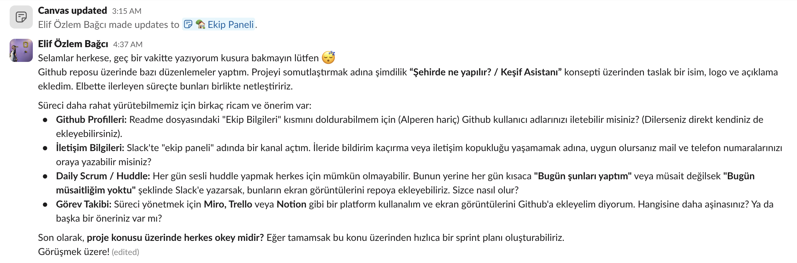
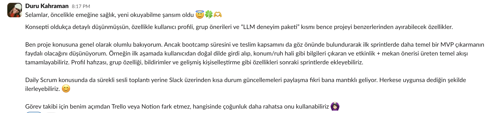
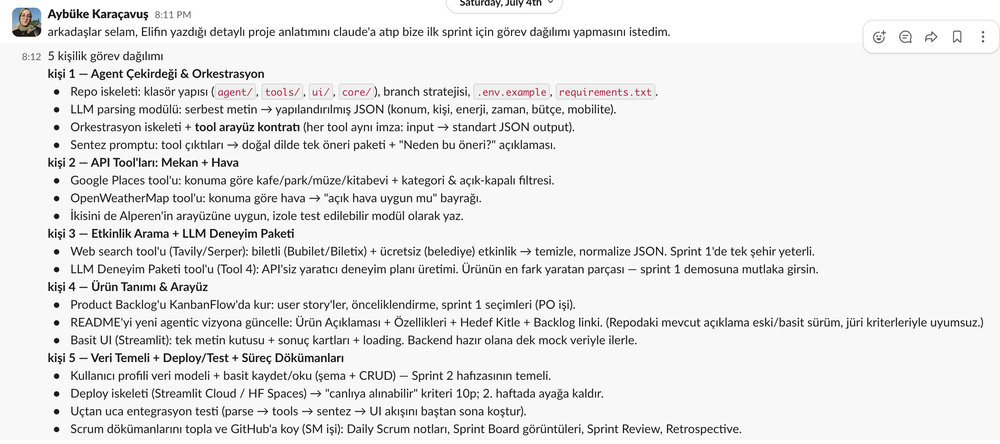

### **Sprint board update:** Sprint board ekran görüntüleri:

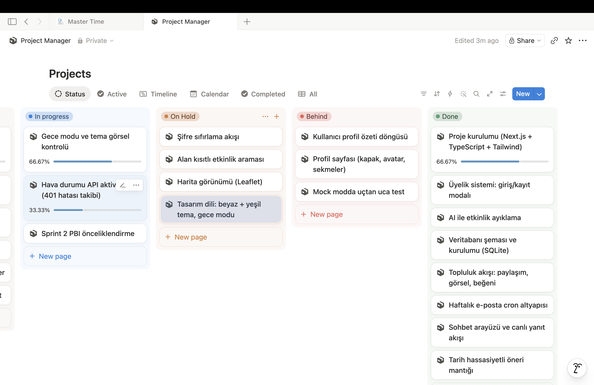
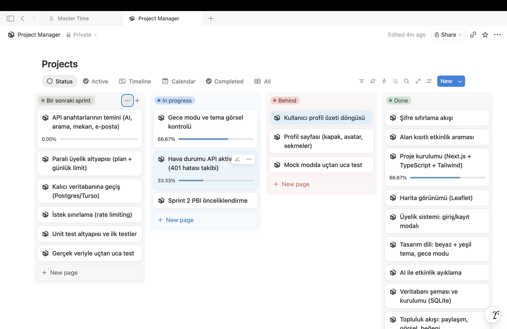
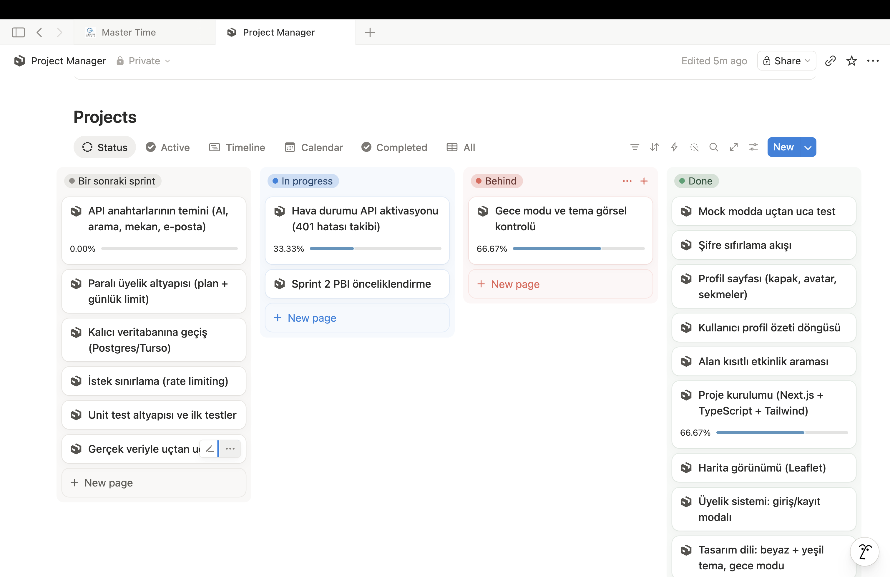

### **Ürün Durumu:** Ekran görüntüleri:

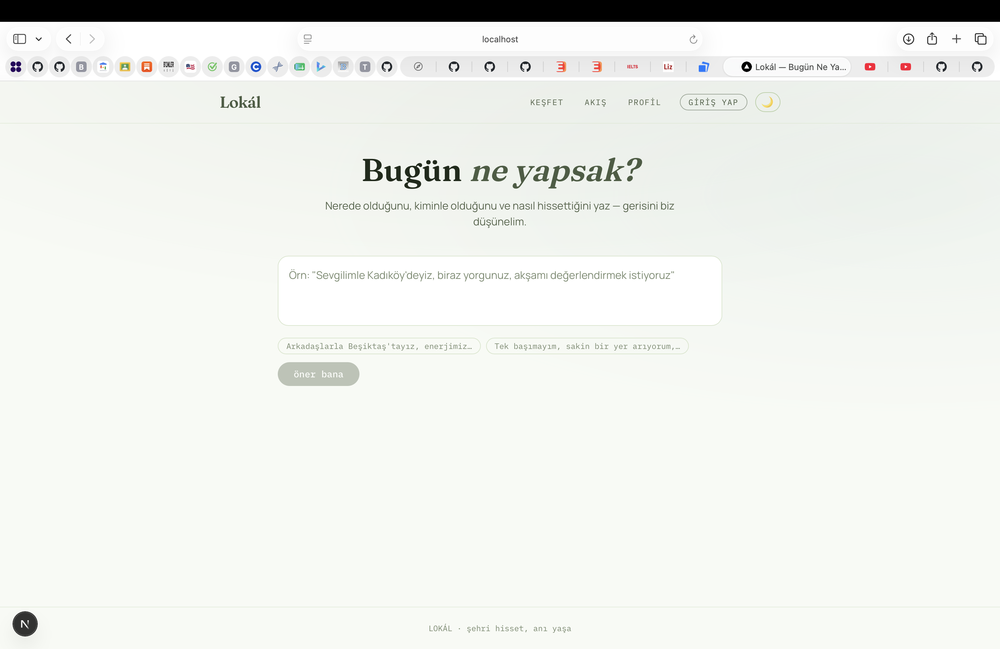
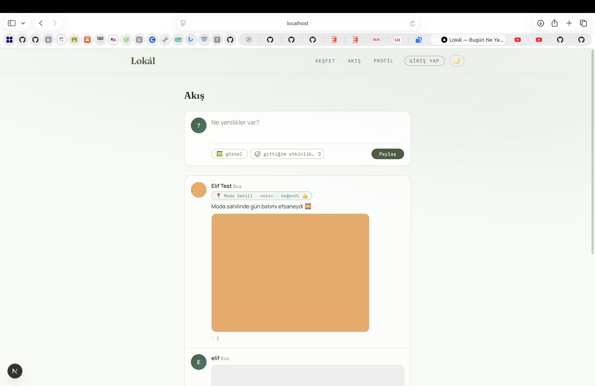
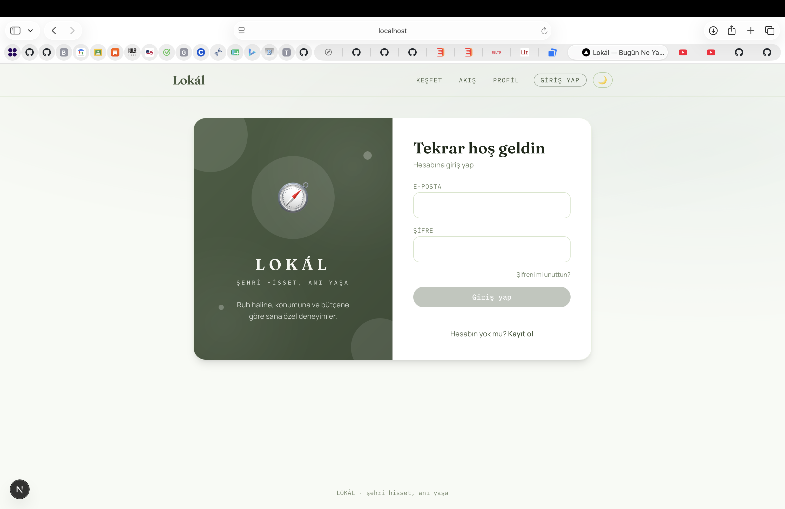
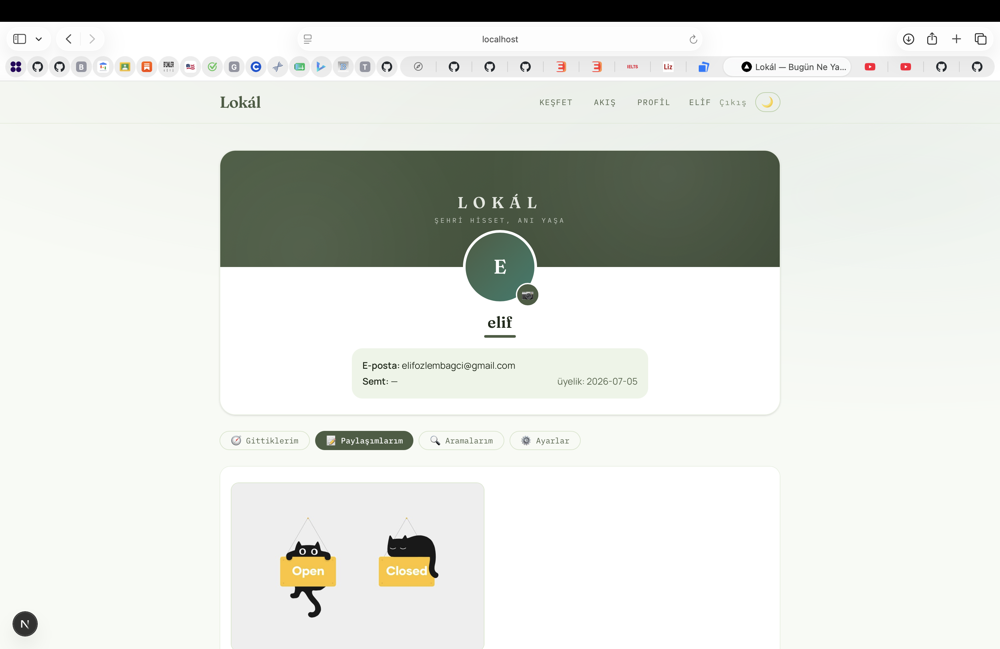
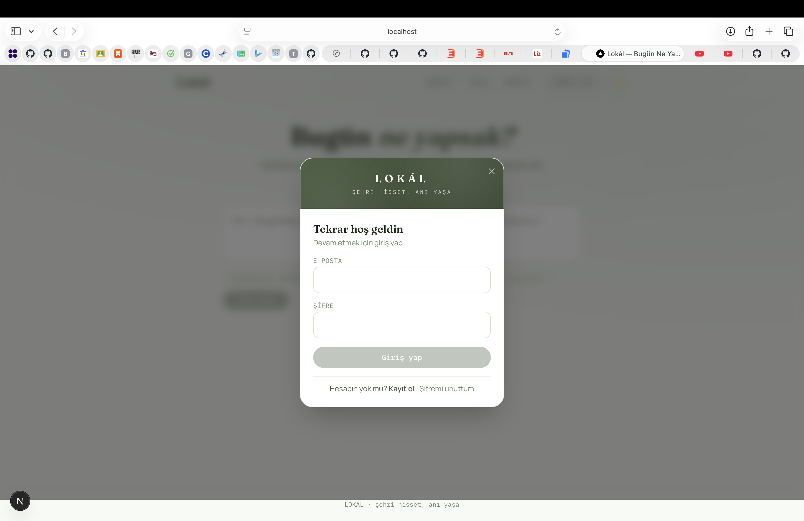

### **Sprint Review:** Alınan kararlar: Sprint sonunda ürünün MVP'si tamamlanmıştır: sohbet tabanlı öneri arayüzü, tarih hassasiyetli etkinlik önerisi, üyelik sistemi (giriş/kayıt, şifre sıfırlama), topluluk akışı, kullanıcı profili, harita görünümü ve haftalık e-posta altyapısı geliştirilmiştir. Gerçek servis anahtarlarının temin edilmesi tamamlanamadığı için gerçek veriyle canlı test bir sonraki sprint'e aktarılmıştır. Sprint Review katılımcıları: Duru Kahraman, Elif Özlem Bağcı, Emre Karataş, Aybüke Karaçavuş, Alperen Yanık

### **Sprint Retrospective:**
   - Takım içindeki görev dağılımıyla ilgili düzenleme yapılması kararı alınmıştır; özellikle API anahtarlarının temini için sorumlu kişi netleştirilmelidir.
   - Tahmin puanları gözden geçirilmeli ve sprint planlama toplantılarında gerekli geri bildirimlerin developer'lar tarafından verildiğine emin olunmalıdır.
   - Unit test'ler için ayrılan efor/saat arttırılmalıdır.
   - Mock veriden gerçek servislere geçiş bir sonraki sprint'in başında ele alınmalıdır.

# Sprint 2

### **Backlog düzeni ve Story seçimleri**:
- Sprint 1'de çıkan MVP'nin üzerine bu sprintte iki ana hedefe odaklandık: ürünü mock veriden gerçek API'lere geçirmek ve tek kullanıcılı bir araçtan sosyal bir ürüne dönüştürmek. Backlog altı epic altında organize edildi ve önceliklendirme "önce ürünü gerçek kılan, sonra ürünü paylaşılabilir kılan" mantığıyla yapıldı.

**EPIC 1 — Kimlik Doğrulama & Güvenlik**

- Kullanıcı e-posta/şifre ile kayıt olabilmeli ve giriş yapabilmeli, çünkü uygulamanın kişiselleştirme yapabilmesi için önce kimlik gerekiyordu.
- Kullanıcı şifresini e-posta üzerinden sıfırlayabilmeli, böylece hesabını kaybetme riski ortadan kalkar.
- Oturum açmamış kullanıcı arama veya paylaşım yapamamalı, otomatik olarak girişe yönlendirilmeli; bu, veri bütünlüğünü korumak ve kötüye kullanımı önlemek için gerekliydi.
- Kullanıcı hesabını ve tüm verilerini kalıcı olarak silebilmeli, verilerini JSON olarak indirebilmeli; bu özellik KVKK'nın silme ve erişim haklarını karşılamak için eklendi.

**EPIC 2 — Yapay Zeka & Kişiselleştirme**

- Sistem serbest metni (konum, zaman, enerji, bütçe, ilgi alanı) yapılandırılmış veriye çevirmeli; böylece kullanıcı doğal dilde yazabiliyor.
- Sistem gerçek bir LLM ile öneri üretmeli (NVIDIA NIM üzerinden Llama 3.3 70B; Anthropic key'i geldiğinde otomatik yükselecek şekilde katmanlı kuruldu). Bu sayede öneriler şablon değil, kullanıcıya özel oluyor.
- Kullanıcı mikrofonla sesli arama yapabilmeli (AssemblyAI, Türkçe destekli); böylece yazmadan da arama yapılabiliyor.
- Kullanıcının geçmiş geri bildirimlerinden otomatik bir zevk profili çıkarılmalı ve bu profil sonraki önerilere yansımalı.
- Kullanıcı üretilen deneyim paketini sohbet yoluyla revize edebilmeli (örn. "daha ucuz olsun"); ilk öneri tam oturmazsa yeniden aramak zorunda kalmıyor.

**EPIC 3 — Etkinlik & Arama Kalitesi**

- Sistem gerçek web araması (Tavily) ile bilet siteleri ve belediye kültür sayfalarını taramalı; amaç, sonuçların gerçekten var olan etkinlikler olmasını sağlamak.
- Kullanıcı hedef tarihi net seçebilmeli (bugün/yarın/hafta sonu/özel tarih); böylece arama, metinden tarih tahmin etmek yerine kullanıcının kontrolünde kalıyor.
- Sistem kullanıcının belirttiği özel ilgi alanlarını (örn. "heykel workshopu") aramaya yansıtmalı; böylece genel sonuçlar yerine isteğe uygun sonuçlar dönüyor.

**EPIC 4 — Sosyal Katman**

- Kullanıcı deneyimlerini görsel ve etkinlik etiketiyle akışta paylaşabilmeli, diğer kullanıcılar beğenip yorum yapabilmeli.
- Kullanıcı arkadaş ekleyip grup planı oluşturabilmeli; bu özellikte birden fazla kişinin zevk profili birleştirilip ortak öneri üretiliyor.
- Uygunsuz içerik şikayet edilebilmeli ve moderatör panelinden kaldırılabilmeli; topluluk herkese açık olduğu için bu güvenlik katmanı gerekliydi.
- Kullanıcı önemli olaylarda (beğeni, yorum, arkadaşlık isteği) hem site içi hem web push bildirimi almalı.
- Kullanıcı rozet kazanarak ve profil istatistiklerini görerek uygulamayı düzenli kullanmaya teşvik edilmeli.

**EPIC 5 — Tasarım Sistemi & Marka**

- Uygulama tutarlı bir marka teması (yeşil, gece/gündüz modlu) kullanmalı.
- Ürünü tanıtan görsel bir landing page (3D dünya küresi, marka renklerine uyarlanmış) olmalı.
- Arayüz etkileşimleri (bildirim, hata, yükleme, silme onayı) tarayıcının varsayılan kutularına dönmeden marka diliyle konuşmalı.

**EPIC 6 — Ürünleşme**
- Uygulama PWA olarak telefona kurulabilmeli.
- Kötüye kullanımı ve maliyet riskini önlemek için arama/paylaşım/yorum saatlik olarak sınırlandırılmalı.
- Yüklenen görseller otomatik küçültülüp optimize edilmeli; amaç depolama alanından tasarruf etmek ve yükleme hızını artırmak.

### **Daily Scrum:** 
- Daily Scrum toplantıları Slack üzerinden yapılmıştır. İletişim Slack üzerinden yürütülmüştür. İletişim kopuklukları çoğunlukla çözülmüştür.

### **Sprint board update:**
- Bu sprintte sprint board yerine to-do dağıtımı ve ilerleme toplantıda konuşulmuştur. 

### **Ürün Durumu:** 

- Sprint sonunda ürün, mock veriyle çalışan bir prototipten dört gerçek API entegrasyonuna sahip, uçtan uca kullanılabilir bir uygulamaya dönüştü. Hava durumu (OpenWeatherMap), sesli arama (AssemblyAI), yapay zeka önerisi (NVIDIA NIM/Llama 3.3) ve etkinlik araması (Tavily) artık gerçek veriyle çalışıyor; mekan önerileri (Google Places) henüz mock modda, bu katman için key temini hâlâ bekliyor.

- Kullanıcı artık kayıt olup giriş yapabiliyor, sesli veya yazılı olarak arama yapabiliyor, aldığı önerileri değerlendirip ("Gittim") deneyimlerini akışta paylaşabiliyor, arkadaş ekleyip ortak plan çıkarabiliyor. Bunların hepsi KVKK'ya uygun, moderasyonu olan ve saatlik kullanım sınırlarıyla korunan bir altyapı üzerinde çalışıyor.

### **Ekran görüntüleri:**

### **Sprint Review:**
**Katılımcılar:** Duru Kahraman, Elif Özlem Bağcı, Emre Karataş, Aybüke Karaçavuş

- İnceleme sırasında şu akışlar uçtan uca canlı olarak gösterildi: kayıt/giriş, sesli ve yazılı arama ile 4 katmanlı öneri üretimi, "Gittim" akışı, akışta paylaşım/beğeni/yorum, arkadaş ekleme ve grup planı oluşturma, moderasyon paneli ve markaya uyarlanmış landing page. Sprint hedefi olan "gerçek API entegrasyonları ve sosyal katman" karşılandı; bunun yanında planın dışında kalan ama sprint içinde ihtiyaç doğan KVKK uyumluluğu ve PWA desteği de bu sprintte tamamlandı.

### **Sprint Retrospective:**
**İyi giden:** Gerçek API entegrasyonları (hava durumu, ses, yapay zeka, arama) planlanandan hızlı tamamlandı ve hiçbiri mimaride ek bir değişiklik gerektirmedi. Sosyal katman ile kimlik doğrulama sistemi sorunsuz bütünleşti.

**Geliştirilebilir:** Marka teması sprint içinde birkaç kez revize edildi (krem'den beyaz/yeşile, landing sayfasındaki turuncudan yeşile); tasarım kararının sprint başında netleştirilmesi tekrar eden işi azaltırdı. Bazı özellikler (etkinlik araması, yapay zeka) ilgili API key'leri gelmeden mock modda geliştirildi; key'ler geldiğinde ince ayar (prompt ve format düzeltmeleri) gerekti.

**Aksiyon maddeleri:** Sıradaki sprintte tema ve tasarım kararlarını en başında netleştirmek. Production veritabanı geçişi gibi altyapısal ihtiyaçları erken sprintte planlamak.

# Sprint 3

### **Backlog düzeni ve Story seçimleri**:

### **Daily Scrum:** Daily Scrum toplantıları Slack üzerinden yapılmıştır.

### **Sprint board update:**
### **Sprint board ekran görüntüleri:**

### **Ürün Durumu:** Ekran görüntüleri:

### **Sprint Review:**

### **Sprint Retrospective:**
